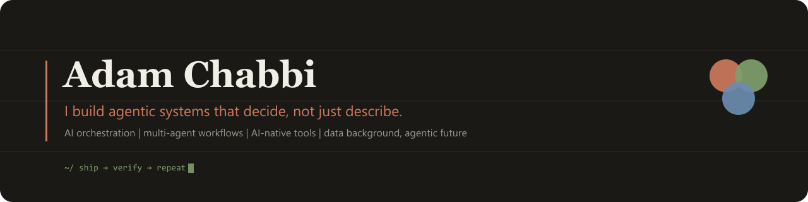

  

  
  
  
  

  
  
  
  
  

---

I spent years turning messy data into decisions people could act on. I started bringing AI agents into that world, then kept going: the more I learned, the further the use cases moved from data, into search, product, and personal tooling. A dashboard tells you what's going on. The systems I build now decide what to do about it, with a person staying in control.

The data background isn't the headline anymore. It's the reason these agents are dependable instead of just clever.

### What I'm building right now

**[AXIS](https://github.com/arochab)** &nbsp;·&nbsp; `flagship` `personal OS` `agentic` `in progress`
The work, the tools, the notes, the decisions: all of it usually lives in twenty open tabs. AXIS is my answer to that, a personal operating system run by agents. One calm command layer that tells me what matters now, hands each task to the right model, and keeps the receipts. Built with Claude Code, in HTML and Python. Private for now; public proof to follow.

**[Claude Eats Tokens](https://github.com/arochab/claude-eats-tokens)** &nbsp;·&nbsp; `AI-native` `Claude Code` `PWA`
You're deep in a Claude Code session and you have no idea how close you are to your limit, right up until you hit it. This app puts the number on your phone: it reads Claude's own logs, learns your usual pace, and gives you a heads-up before you run out. Free hosting, installs like a real app, updates itself. &nbsp;→&nbsp; [live](https://arochab.github.io/claude-eats-tokens/)

**[BrandPulse](https://github.com/arochab/brandpulse-app)** &nbsp;·&nbsp; `AI orchestration` `decision system` `Python`
Someone searches *"best tool for X"* and finds a result. Is it you, or the competitor you'd rather they didn't see? Type one brand name and you'll know: the AI maps out who you're really up against and what a buyer would actually search, then live Google data shows who comes out on top. Your search visibility, made plain, for a fraction of a cent. &nbsp;→&nbsp; [live](https://brandpulse-app.onrender.com/)

**[Kapman Toolkit](https://github.com/arochab/kapman-toolkit-2)** &nbsp;·&nbsp; `product` `decision layer` `Svelte`
The hard part of finishing a track isn't making sounds, it's knowing what to fix next, before the session slips away from you. This is a quiet workspace for that decision: check the mix, go straight to the fix that fits, and keep every project's thread in one place. Built with Svelte and TypeScript, accounts and saved work on Supabase. &nbsp;→&nbsp; [repo](https://github.com/arochab/kapman-toolkit-2)

**[Lumiere Portfolio Pack](https://github.com/arochab/lumiere-portfolio-pack)** &nbsp;·&nbsp; `data foundation` `Power BI`
Before agents could be trusted with decisions, the data had to be right. This is that craft, packaged: an executive analytics pack with a clean data model, the calculations behind every number, and a showcase you can open right now. &nbsp;→&nbsp; [showcase](https://arochab.github.io/lumiere-portfolio-pack/)

### How I work

- I build the whole thing and check it runs before I call it done. A working link beats a screenshot; a screenshot beats a bold claim.
- I treat reliability as a data question first and a model question second. An agent should be easy to watch, easy to steer, and grounded in real information.
- I keep things small, sharp, and cheap to run. The simplest setup that ships today usually wins.

### Stack & tooling

*Grouped by what the projects above demonstrate. The list grows as I do.*

`AI & agents` Claude Code · MCP · LLM orchestration · multi-agent workflows · prompt design
`Build` Svelte 5 · TypeScript · Python · Flask · vanilla JS · PWA (offline, push) · Tailwind
`Data & decisions` decision-system design · Power BI · DAX · Power Query · data modeling
`Delivery` GitHub Actions / CI · GitHub Pages & Render · cost control · secret management

### Elsewhere

Always up for a conversation about agentic systems, AI orchestration, and AI-native products.

[GitHub](https://github.com/arochab) &nbsp;|&nbsp; [LinkedIn](https://www.linkedin.com/in/adamchabbi)

Some things stay private by design: the product cores, the orchestration, and the data behind them.
